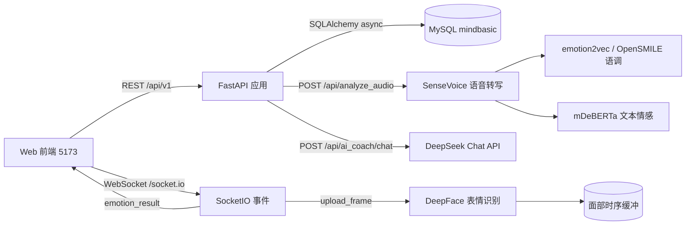

# MindBasic 后端服务

心理教练成长服务平台（MindBasic）的 FastAPI 后端。为响应式 Web 前端提供 REST API，
覆盖用户端自助工具、教练端工作台、管理后台，以及内嵌的 **AI 实验室**（实时表情识别、
多模态情绪分析、DeepSeek AI 心理教练）。

相关项目：前端仓库 `MindBasic-frontend`（开发地址 `http://127.0.0.1:5173`），
AI 实验室页面为 `/ai-chat`（豆包式对话）与 `/video-call`（AI 视频通话）。

## 技术栈

| 组件 | 选型 | 说明 |
| --- | --- | --- |
| Web 框架 | FastAPI | 自动 OpenAPI 文档（`/docs`） |
| 实时通信 | python-socketio（ASGI） | 与 FastAPI 共用同一 ASGI 应用（`app.main:socket_app`） |
| ORM | SQLAlchemy 2.x（异步） | asyncmy 驱动，AsyncSession 应用层会话 |
| 迁移 | Alembic | 同步会话执行迁移，`compare_type=True` |
| 数据库 | MySQL 8（utf8mb4） | 本地开发默认 `mindbasic` 库 |
| 校验 | Pydantic v2 | 入参/出参统一模型，snake_case ↔ camelCase |
| 认证 | PyJWT + bcrypt | Access/Refresh 双令牌，Refresh 轮换 + httpOnly Cookie |
| 限流 | 可插拔 | 内存滑动窗口（默认）/ Redis 固定窗口 |
| 邮件 | smtplib | 邮箱验证码（登录/找回密码/绑定邮箱），465 SSL / 587 STARTTLS |
| AI 实验室 | funasr / opensmile / deepface / torch / tensorflow | 语音转写、语调情感、表情识别、融合分析 |
| AI 教练 | DeepSeek Chat API | 以识别结果为上下文做心理教练式引导 |
| 测试 | pytest | 集成测试直连开发库，73 项覆盖核心链路 |

## 架构总览



## 环境要求

- Python 3.12
- MySQL 8.0（本地或远程均可）
- （可选）Redis：仅在 `RATE_LIMIT_BACKEND=redis` 时使用
- AI 实验室：
  - 内存建议 ≥ 8 GB 可用（四个模型常驻约 3~4 GB）；
  - 首次运行会自动下载模型权重（ModelScope / HuggingFace 镜像），需要联网；
  - 重型依赖见 [requirements-ai.txt](requirements-ai.txt)，torch / tensorflow 按平台单独安装。

## 快速开始

```bash
# 1. 创建并激活虚拟环境（conda 示例）
conda create -n relmind-backend python=3.12 -y
conda activate relmind-backend

# 2. 安装依赖（含锁定版本）
cd backend
pip install -r requirements.txt
# 复现锁定版本：pip install -r requirements.lock

# 3. 可选：安装 AI 实验室重型依赖（CPU 版示例）
pip install torch torchaudio tensorflow tf-keras
pip install -r requirements-ai.txt

# 4. 创建数据库
mysql -uroot -p -e "CREATE DATABASE IF NOT EXISTS mindbasic DEFAULT CHARACTER SET utf8mb4 COLLATE utf8mb4_unicode_ci;"

# 5. 配置环境变量
cp .env.example .env
# 编辑 .env：DATABASE_URL / JWT_SECRET_KEY 必填（缺失会启动失败）
# 可选：DEEPSEEK_API_KEY（AI 心理教练，未配置时该接口返回 503）

# 6. 执行迁移（建表 + 种子数据：标签、自我教练模板、话术库、初始管理员、社群、测评量表）
alembic upgrade head

# 7. 可选：写入演示数据（2 个教练、示例内容）
python scripts/demo_seed.py

# 8. 启动开发服务（127.0.0.1:8000）
python scripts/run_dev.py
# 或 uvicorn app.main:socket_app --reload

# 9. 跑测试
pytest tests -q
```

> 初始管理员：`13800138000 / Admin@123456`（首次登录后请修改密码）。

启动后：

- OpenAPI 文档：`http://127.0.0.1:8000/docs`
- 健康检查：`http://127.0.0.1:8000/health`
- SocketIO：`http://127.0.0.1:8000/socket.io/`
- AI 模型状态：`http://127.0.0.1:8000/api/analyze_audio/config_check`

## 环境变量（.env）

| 变量 | 必填 | 说明 |
| --- | --- | --- |
| `DATABASE_URL` | 是 | `mysql+pymysql://用户:密码@主机:3306/mindbasic?charset=utf8mb4`，密码含特殊字符需 URL 编码 |
| `JWT_SECRET_KEY` | 是 | 随机 64 位 hex，缺失或占位值启动失败 |
| `ACCESS_TOKEN_EXPIRE_MINUTES` | 否 | Access Token 有效期，默认 120 |
| `REFRESH_TOKEN_EXPIRE_DAYS` | 否 | Refresh Token 有效期，默认 14 |
| `COOKIE_SECURE` | 否 | 生产（DEBUG=false）强制 true |
| `CORS_ORIGINS` | 否 | 生产环境需显式配置前端域名 |
| `RATE_LIMIT_BACKEND` | 否 | `memory`（单实例）/ `redis`（多实例，需 `REDIS_URL`） |
| `REDIS_URL` | 否 | Redis 连接串，限流/黑名单/缓存切 Redis 时使用 |
| `EMAIL_ENABLED` | 否 | false 时验证码打印在后端日志，方便开发联调 |
| `SMTP_HOST/PORT/USER/PASSWORD/FROM` | 否 | 邮箱发送；QQ/163 用 465（SSL），STARTTLS 服务用 587 |
| `DEEPSEEK_API_KEY` | 否 | DeepSeek Key，AI 心理教练；未配置时 `/api/ai_coach/chat` 返回 503 |
| `SENSEVOICE_DEVICE` | 否 | SenseVoice 设备，留空自动检测（`cuda`/`cpu`） |
| `DEEPSEEK_BASE_URL/MODEL/TIMEOUT` | 否 | DeepSeek 覆盖项（默认 api.deepseek.com / deepseek-chat / 90s） |
| `TTS_VOICE` / `TTS_RATE` | 否 | 视频通话语音合成（edge-tts，免费）；默认 `zh-CN-XiaoxiaoNeural` / `+20%` |
| `VLM_API_KEY` / `VLM_BASE_URL` / `VLM_MODEL` | 否 | 视频通话视觉理解（OpenAI 兼容 Vision API）；未配置时跳过视觉理解 |

## 目录结构

```
backend/
├── alembic/                 # 迁移脚本（版本链 + 种子数据）
├── app/
│   ├── api/v1/              # 路由层
│   │   ├── auth.py users.py coaches.py coach.py appointments.py
│   │   ├── articles.py emotion_journals.py self_coaching.py checkins.py
│   │   ├── communities.py growth_assessments.py notifications.py files.py
│   │   ├── home.py platform.py tags.py admin.py
│   │   ├── ai_lab.py        # 多模态音频分析（/api/analyze_audio*）
│   │   └── ai_coach.py      # AI 心理教练（/api/ai_coach/chat）
│   ├── core/                # 配置、异常、安全、限流、缓存、日志、黑名单
│   ├── db/                  # 引擎与会话（async 应用 / sync 迁移与脚本）
│   ├── models/              # SQLAlchemy 模型（user、coach、content、growth、community…）
│   ├── schemas/             # Pydantic 请求/响应模型
│   ├── services/
│   │   ├── ai_lab/          # AI 实验室子系统
│   │   │   ├── config.py            # 路径/超时/DeepSeek 配置
│   │   │   ├── sensevoice_service.py    # 语音转写（ASR + emo）
│   │   │   ├── emotion2vec_service.py   # 语调情感
│   │   │   ├── text_emotion_service.py  # 文本情感（零样本）
│   │   │   ├── opensmile_service.py     # OpenSMILE 语调（降级）
│   │   │   ├── fusion_service.py        # 多模态融合引擎
│   │   │   ├── facial_buffer.py         # 面部时序缓冲（per-sid）
│   │   │   ├── socket_events.py         # SocketIO 事件注册
│   │   │   ├── realtime_session.py      # 视频通话会话状态
│   │   │   ├── tts_service.py           # edge-tts 语音合成
│   │   │   ├── vlm_service.py           # VLM 视觉理解（可选）
│   │   │   └── sensevoice/              # SenseVoice 远程代码
│   │   └── …                # 业务服务（认证、预约、个案、社群、测评、邮件…）
│   └── utils/               # 时间、格式化等工具
├── scripts/
│   ├── run_dev.py               # 开发启动（app.main:socket_app）
│   ├── demo_seed.py             # 演示数据
│   └── cleanup_orphan_files.py  # 清扫上传孤儿文件（支持 --dry-run）
├── tests/                  # pytest 集成测试（16 个文件，73 项）
├── requirements.txt        # 直接依赖
├── requirements.lock       # pip-compile 锁定
└── requirements-ai.txt     # AI 实验室重型依赖（可选）
```

## 功能模块

### 用户端

- **账号**：手机号注册/登录、邮箱验证码登录、找回密码、绑定/换绑邮箱、Token 刷新、登出、注销、Access Token 黑名单
- **自助工具**：自我教练（5 模板四步流程 + 成长行动卡）、情绪日记（预设话术 + 趋势 + 月度心情日历）
- **教练服务**：教练目录/详情/评价、在线预约（防超卖 + 幂等键）、我的预约、评价
- **科普**：文章分类/详情/收藏、首页聚合（匿名缓存）
- **成长体系**：每日打卡、排行榜、勋章、成长测评（资源导向，不诊断）
- **社群**：主题社群、加入/退出、帖子/评论/点赞
- **通知**：站内消息（预约、审核等）

### 教练端

- 入驻审核、预约管理、个案记录（Markdown + 导出）、服务/时段管理
- 客户管理（含待跟进提醒）、话术库（收藏 + 自定义）、收到的评价、社群管理

### 管理后台

- 用户（含注册时间筛选）、教练审核、文章/分类/轮播/标签/话术库
- 平台配置（心理援助热线/免责声明）、社群上下架、概览统计

### AI 实验室

- 实时表情识别：SocketIO `upload_frame` → `emotion_result`（DeepFace，含投入分/级别/情绪分布）
- 语音转文字：SenseVoice（中文为主，含 emo 标签）
- 语调情感：emotion2vec+，失败自动降级 OpenSMILE（eGeMAPSv02）
- 文本情感：mDeBERTa-v3 零样本
- 多模态融合：文本 + 语调 + 面部时序 → 融合情绪与置信度
- AI 心理教练：DeepSeek 对话，自动携带识别上下文（表情/语调/转写/投入度）
- AI 视频通话：实时语音对话 + edge-tts 语音回复 + 打断；配置 VLM Key 后支持视觉理解

## API 约定

### REST 通用约定

- 统一前缀：`/api/v1`；统一响应：`{ code, message, data, traceId }`
- 错误码：业务错误 `{ status, code, message }`，如 `PHONE_EXISTS`、`CODE_INVALID`、`RATE_LIMITED`
- 分页：`{ items, pagination: { page, pageSize, totalItems, totalPages, hasMore } }`
- 鉴权：`Authorization: Bearer <accessToken>`；Refresh Token 走 httpOnly Cookie（`/api/v1/auth/refresh`）
- 在线文档：`http://127.0.0.1:8000/docs`

主要端点：

| 分组 | 端点示例 |
| --- | --- |
| 认证 | `/auth/register` `/auth/login` `/auth/email-code` `/auth/email-login` `/auth/reset-password` `/auth/refresh` `/auth/logout` |
| 用户 | `/users/me` `/users/me/email` `/users/me/favorites` `/users/me/badges` |
| 自助工具 | `/self-coaching/templates|records` `/emotion-journals` `/emotion-journals/trend|calendar` |
| 教练服务 | `/coaches` `/coaches/{id}/slots|reviews` `/appointments` |
| 教练端 | `/coach/profile|services|slots|clients|appointments|cases|reviews|phrases` |
| 科普/首页 | `/articles` `/home` `/platform/config` |
| 成长 | `/check-ins` `/check-ins/leaderboard` `/growth-assessments` |
| 社群 | `/communities` `/communities/{id}/posts` `/communities/{id}/posts/{postId}/comments|like` |
| 后台 | `/admin/users|coach-audits|articles|banners|tags|feedback-lib|communities|system-configs|stats` |

### AI 实验室接口（独立命名空间，返回自有 JSON 结构，不走统一信封）

#### `POST /api/analyze_audio`

上传完整段音频做多模态分析。`multipart/form-data`：

| 字段 | 说明 |
| --- | --- |
| `file` | 音频文件（webm/wav/mp3 等，≤ 50 MB） |
| `sid` | SocketIO 客户端 ID（用于提取录音时段面部帧，可空） |
| `record_start_ts` / `record_end_ts` | 录音起止毫秒时间戳 |

响应包含 `status`（ok/partial_success/failed）、`transcription`、`text_emotion`、
`voice_emotion`、`facial_emotion`、`fusion`、`errors`、`timing`、`server_info.models_loaded`。

#### `GET /api/analyze_audio/config_check`

查看四个模型加载状态（`loaded` / `load_error` / `device_used`）。

#### `POST /api/analyze_audio/warmup`

手动触发模型预热，返回各模型 `ok` 或失败原因。用于内存恢复后补加载。

#### `POST /api/vc_audio_upload`

视频通话音频上传。`multipart/form-data`：

| 字段 | 说明 |
| --- | --- |
| `file` | 音频 Blob（webm/ogg/mp3/wav 等） |
| `sid` | SocketIO 客户端 ID |

返回 `{ ok, file_id, file_path, file_size }`；前端随后通过 `vc_audio_end` 携带 `file_id`
交给视频通话管线处理（避免 socket 分片乱序）。

#### `POST /api/ai_coach/chat`

AI 心理教练对话。请求：

```json
{
  "messages": [{ "role": "user", "content": "我最近很累" }],
  "context": {
    "transcription": "我最近很累",
    "text_emotion": "悲伤",
    "voice_emotion": "平静",
    "facial_emotion": "悲伤",
    "fusion_emotion": "悲伤",
    "fusion_confidence": 0.78,
    "live_score": 45,
    "live_level": "BORING"
  }
}
```

响应：`{ "reply": "...", "model": "deepseek-chat", "usage": {...} }`。
上下文字段均可选，缺省时 AI 按纯文本引导。

### SocketIO 事件

| 事件 | 方向 | 说明 |
| --- | --- | --- |
| `connect` / `disconnect` | 双向 | 建立/断开连接，自动维护 per-sid 状态 |
| `upload_frame` | 前端 → 后端 | `{ imgBase64 }` 画面帧（节流 0.4s） |
| `emotion_result` | 后端 → 前端 | `{ timestamp, score, level, students, alert, emotions, processing_time_ms }` |
| `emotion_error` | 后端 → 前端 | `{ error, message }` |
| `upload_audio` | 前端 → 后端 | 预留事件（当前仅记录日志） |

视频通话事件（`vc_*`，独立命名空间，不影响情绪识别）：

| 事件 | 方向 | 说明 |
| --- | --- | --- |
| `vc_start` / `vc_stop` | 前端 → 后端 | 开始/结束视频通话会话 |
| `vc_audio_chunk` / `vc_audio_end` | 前端 → 后端 | 音频分片/结束（`vc_audio_end` 携带 `file_id`） |
| `vc_interrupt` | 前端 → 后端 | 用户打断（停止后续 TTS，不中断 LLM 生成） |
| `vc_update_frame` / `vc_update_emotion` | 前端 → 后端 | 更新 VLM 画面帧 / 情绪上下文 |
| `vc_clear_history` | 前端 → 后端 | 清空会话对话历史 |
| `vc_state_change` | 后端 → 前端 | 状态切换（listening/thinking/speaking/idle） |
| `vc_asr_result` / `vc_emotion_analysis` | 后端 → 前端 | 语音转写结果 / 情绪分析结果 |
| `vc_llm_token` / `vc_llm_done` | 后端 → 前端 | LLM 流式 token / 完成 |
| `vc_tts_start` / `vc_tts_chunk` / `vc_tts_done` | 后端 → 前端 | TTS 语音分句合成进度 |
| `vc_vlm_result` | 后端 → 前端 | 视觉理解结果 |
| `vc_interrupted` / `vc_error` | 后端 → 前端 | 打断确认 / 错误 |

## 数据库与迁移

- 表结构由 `app/models/` 定义，迁移统一走 Alembic（版本链见 `alembic/versions/`）；
- 新增字段/表：修改模型后 `alembic revision --autogenerate -m "..."`，检查脚本后 `alembic upgrade head`；
- 种子数据（标签、5 套模板与问句、话术库、初始管理员、社群、测评量表）在各迁移中插入，可随版本演进；
- 注意：MySQL DDL 非事务，迁移失败后先清理残留对象再重跑。

## 测试

```bash
cd backend
pytest tests -q                    # 全量 73 项
pytest tests/test_auth.py -q       # 单模块
```

- 测试直连开发库，使用唯一手机号并在 teardown 清理；跑完建议清一下 `email_verification_codes` 等临时表避免冷却误伤：
  ```sql
  DELETE FROM email_verification_codes;
  ```
- `conftest.py` 提供 `client` / `auth_headers` / `admin_headers` 模块级夹具；
- 邮箱验证码测试通过打桩 `email_service.send_email` 捕获验证码，不依赖真实 SMTP；
- AI 重型依赖（torch/tensorflow/deepface）全部懒加载，测试导入主应用不会拉起模型，退出也不会崩溃。

## AI 实验室运行说明

### 启动

必须通过 `app.main:socket_app` 启动（FastAPI + SocketIO 共用 ASGI 应用），
`scripts/run_dev.py` 已配置。AI 实验室建议单进程运行（`--workers 1`），
因为模型常驻内存且面部缓冲为进程内状态。

### 模型与内存

| 模型 | 用途 | 内存 |
| --- | --- | --- |
| SenseVoiceSmall | 语音转写 + emo | ~1 GB |
| emotion2vec_plus_large | 语调情感 | ~1 GB |
| mDeBERTa-v3 | 文本情感 | ~0.5 GB |
| OpenSMILE eGeMAPSv02 | 语调降级 | 较小 |
| DeepFace（mtcnn） | 实时表情 | 随 TensorFlow 常驻 |

模型权重首次运行自动下载（ModelScope / HuggingFace 镜像缓存于用户目录），
后续启动复用缓存。全部加载完成后常驻约 3~4 GB。

### 预热机制

- 服务启动（lifespan）后后台线程自动顺序预热四个模型；
- 各模型加载带单飞锁（single-flight），并发触发不会重复加载导致内存翻倍；
- 可通过 `/api/analyze_audio/config_check` 查看加载状态，失败时可调用
  `/api/analyze_audio/warmup` 重试；
- 若系统内存不足导致加载失败（`DefaultCPUAllocator: not enough memory`），
  先释放内存（关闭大内存程序），再调 `warmup` 补加载。

### 安全与合规

- AI 教练不诊断、不治疗、不贴标签；系统提示词内置危机信号转介（心理援助热线 12356）；
- `DEEPSEEK_API_KEY` 只从 `.env` 读取，`.env` 已 gitignore，禁止提交；
- AI 实验室接口当前不要求登录（本地实验功能），若上线公网建议加鉴权与频控。

## 部署

```bash
# 生产：单 worker + HTTPS 反代（AI 实验室模型常驻，勿开多 worker）
uvicorn app.main:socket_app --host 0.0.0.0 --port 8000 --workers 1
```

- 生产环境配置：`DEBUG=false`、`COOKIE_SECURE=true`、显式 `CORS_ORIGINS`；
- 多实例部署：`RATE_LIMIT_BACKEND=redis` 并配置 `REDIS_URL`（黑名单/首页缓存同样建议切 Redis，接口已抽象）；
- Nginx 反向代理需同时转发：
  - `/api` → 后端；
  - `/socket.io` → 后端，并配置 WebSocket 升级头（`Upgrade` / `Connection`）；
- 静态资源交给前端静态托管/CDN；
- 邮件：配置 SMTP 后 `EMAIL_ENABLED=true`；验证码在服务端校验（哈希存储、一次性、60s 冷却、5 次错误作废）；
- AI 实验室服务器建议内存 ≥ 8 GB 可用，并保证 C 盘/系统盘留有足够空间给页面文件与模型缓存。

## 常见问题

- **启动报“配置校验失败”**：检查 `DATABASE_URL`、`JWT_SECRET_KEY`；生产环境检查 `COOKIE_SECURE`、`CORS_ORIGINS`。
- **迁移报“Duplicate column”**：MySQL DDL 非事务，清理已创建对象后重跑。
- **验证码收不到**：`EMAIL_ENABLED=false` 时看后端日志；true 时检查授权码/端口（QQ 465 SSL）。
- **语音转文字失败**：先看 `/api/analyze_audio/config_check` 中 `sensevoice.loaded`；
  未加载则内存不足或首次下载未完成，释放内存后调 `/api/analyze_audio/warmup`。
- **AI 教练返回 503**：`.env` 未配置 `DEEPSEEK_API_KEY`，或 Key 失效（查看响应 detail）。
- **服务进程被系统杀掉**：多为内存耗尽（模型 + 系统占用超限），关闭大内存程序或增加内存后再启动。
- **测试退出时 torch 日志报错**：已通过懒加载修复；确认 `app.main` 导入时不应加载 torch/tensorflow。
- **时区**：应用按 UTC 存储（`utcnow_naive`），数据库服务器时间可能为本地时间；涉及跨时区比较的新逻辑请统一使用 `utcnow_naive`。
