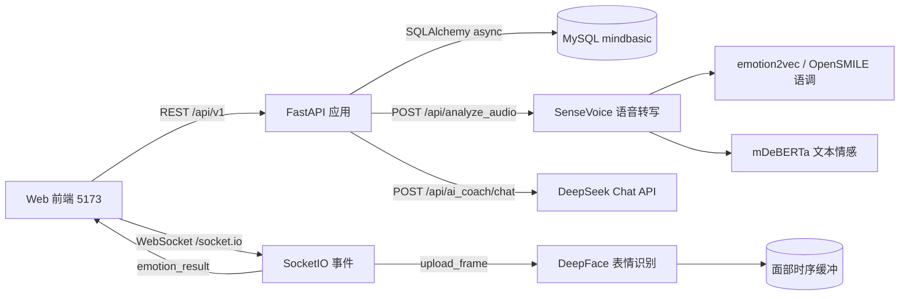

# MindBasic 后端服务

心理教练成长服务平台（MindBasic）的 FastAPI 后端。为响应式 Web 前端提供 REST API，
覆盖用户端自助工具、教练端工作台、管理后台，以及内嵌的 **AI 实验室**（实时表情识别、
多模态情绪分析、DeepSeek AI 心理教练）。

相关项目：前端仓库 `MindBasic-frontend`（开发地址 `http://127.0.0.1:5173`），
AI 实验室页面为 `/ai-chat`（豆包式对话）与 `/video-call`（AI 视频通话）。

## 技术栈

| 组件 | 选型 | 说明 |
| --- | --- | --- |
| Web 框架 | FastAPI | 自动 OpenAPI 文档（`/docs`） |
| 实时通信 | python-socketio（ASGI） | 与 FastAPI 共用同一 ASGI 应用（`app.main:socket_app`） |
| ORM | SQLAlchemy 2.x（异步） | asyncmy 驱动，AsyncSession 应用层会话 |
| 迁移 | Alembic | 同步会话执行迁移，`compare_type=True` |
| 数据库 | MySQL 8（utf8mb4） | 本地开发默认 `mindbasic` 库 |
| 校验 | Pydantic v2 | 入参/出参统一模型，snake_case ↔ camelCase |
| 认证 | PyJWT + bcrypt | Access/Refresh 双令牌，Refresh 轮换 + httpOnly Cookie |
| 限流 | 可插拔 | 内存滑动窗口（默认）/ Redis 固定窗口 |
| 邮件 | smtplib | 邮箱验证码（登录/找回密码/绑定邮箱），465 SSL / 587 STARTTLS |
| AI 实验室 | funasr / opensmile / deepface / torch / tensorflow | 语音转写、语调情感、表情识别、融合分析 |
| AI 教练 | DeepSeek Chat API | 以识别结果为上下文做心理教练式引导 |
| 测试 | pytest | 集成测试直连开发库，80 项覆盖核心链路 |

## 架构总览


```mermaid
flowchart LR
    FE[Web 前端 5173] -- REST /api/v1 --> API[FastAPI 应用]
    FE -- WebSocket /socket.io --> SIO[SocketIO 事件]
    API -- SQLAlchemy async --> DB[(MySQL mindbasic)]
    SIO -- upload_frame --> DF[DeepFace 表情识别]
    SIO -- emotion_result --> FE
    API -- POST /api/analyze_audio --> ASR[SenseVoice 语音转写]
    ASR --> EV[emotion2vec / OpenSMILE 语调]
    ASR --> TE[mDeBERTa 文本情感]
    DF --> FB[(面部时序缓冲)]
    API -- POST /api/ai_coach/chat --> DS[DeepSeek Chat API]
```

## 环境要求

- Python 3.12
- MySQL 8.0（本地或远程均可）
- （可选）Redis：仅在 `RATE_LIMIT_BACKEND=redis` 时使用
- AI 实验室：
  - 内存建议 ≥ 8 GB 可用（四个模型常驻约 3~4 GB）；
  - 首次运行会自动下载模型权重（ModelScope / HuggingFace 镜像），需要联网；
  - 重型依赖见 [requirements-ai.txt](requirements-ai.txt)，torch / tensorflow 按平台单独安装。

## 快速开始

```bash
# 1. 创建并激活虚拟环境（conda 示例）
conda create -n relmind-backend python=3.12 -y
conda activate relmind-backend

# 2. 安装依赖（含锁定版本）
cd backend
pip install -r requirements.txt
# 复现锁定版本：pip install -r requirements.lock
# 说明：socketio / requests / jieba 属于核心运行时依赖（已列在 requirements.txt），
#       缺失会导致后端无法启动或知识库检索静默失效

# 3. 可选：安装 AI 实验室重型依赖（CPU 版示例）
pip install torch torchaudio tensorflow tf-keras
pip install -r requirements-ai.txt
# 未安装时 ASR / 语调情感 / 文本情感 / VLM 会降级，启动日志里会逐条给出原因

# 3.1 知识库无需任何准备步骤
# 卡片随代码发布在 knowledge_base/，后端首次检索时自动构建索引；
# 也不需要在 Dify 里建数据集或上传文件。

# 4. 创建数据库
mysql -uroot -p -e "CREATE DATABASE IF NOT EXISTS mindbasic DEFAULT CHARACTER SET utf8mb4 COLLATE utf8mb4_unicode_ci;"

# 5. 配置环境变量
cp .env.example .env
# 编辑 .env：DATABASE_URL / JWT_SECRET_KEY 必填（缺失会启动失败）
# 可选：DEEPSEEK_API_KEY（AI 心理教练，未配置时该接口返回 503）

# 6. 执行迁移（建表 + 种子数据：标签、自我教练模板、话术库、初始管理员、社群、测评量表）
alembic upgrade head

# 7. 可选：写入演示数据（2 个教练、示例内容）
python scripts/demo_seed.py

# 8. 启动开发服务（127.0.0.1:8000）
python scripts/run_dev.py
# 或 uvicorn app.main:socket_app --reload

# 9. 跑测试
pytest tests -q
```

> 初始管理员：`13800138000 / Admin@123456`（首次登录后请修改密码）。

启动后：

- OpenAPI 文档：`http://127.0.0.1:8000/docs`
- 健康检查：`http://127.0.0.1:8000/health`
- 就绪探针（含数据库连通性）：`http://127.0.0.1:8000/health/ready`
- Prometheus 指标：`http://127.0.0.1:8000/metrics`
- SocketIO：`http://127.0.0.1:8000/socket.io/`
- AI 模型状态：`http://127.0.0.1:8000/api/analyze_audio/config_check`

## 环境变量（.env）

| 变量 | 必填 | 说明 |
| --- | --- | --- |
| `DATABASE_URL` | 是 | `mysql+pymysql://用户:密码@主机:3306/mindbasic?charset=utf8mb4`，密码含特殊字符需 URL 编码 |
| `JWT_SECRET_KEY` | 是 | 随机 64 位 hex，缺失或占位值启动失败 |
| `ACCESS_TOKEN_EXPIRE_MINUTES` | 否 | Access Token 有效期，默认 120 |
| `REFRESH_TOKEN_EXPIRE_DAYS` | 否 | Refresh Token 有效期，默认 14 |
| `COOKIE_SECURE` | 否 | 生产（DEBUG=false）强制 true |
| `CORS_ORIGINS` | 否 | 生产环境需显式配置前端域名 |
| `RATE_LIMIT_BACKEND` | 否 | `memory`（单实例）/ `redis`（多实例，需 `REDIS_URL`） |
| `REDIS_URL` | 否 | Redis 连接串，限流/黑名单/缓存切 Redis 时使用 |
| `EMAIL_ENABLED` | 否 | false 时验证码打印在后端日志，方便开发联调 |
| `SMTP_HOST/PORT/USER/PASSWORD/FROM` | 否 | 邮箱发送；QQ/163 用 465（SSL），STARTTLS 服务用 587 |
| `DEEPSEEK_API_KEY` | 否 | DeepSeek Key，AI 心理教练；未配置时 `/api/ai_coach/chat` 返回 503 |
| `DIFY_API_BASE` / `DIFY_API_KEY` | 否 | Dify 智能体（视频通话 LLM）；Key 必须是**应用密钥**（`app-` 开头，`dataset-` 开头的是知识库密钥，调不通 `/chat-messages`）。配置后**优先走 Dify**（云端 `https://api.dify.ai/v1`，本地 Docker 用 `http://<host>:18080/v1`），失败时按「单轮回退 + 熔断」降级到 DeepSeek（详见下文「LLM 供应商选择与回退」）。自检：`python scripts/check_dify.py` |
| `LLM_RETRIES` | 否 | LLM 请求连接失败自动重试次数，默认 3（应对 SSL EOF / 超时等瞬时故障） |
| `DIFY_CIRCUIT_THRESHOLD` / `DIFY_CIRCUIT_COOLDOWN` | 否 | Dify 熔断阈值：连续失败几轮后跳过 Dify（默认 3 轮）、跳过时长（默认 120 秒）。冷却结束自动再试，任一成功即复位 |
| `KB_RERANK_ENABLED` | 否 | 知识库检索是否用 DeepSeek 做查询扩展 + 重排，默认 true；设为 false 退回纯 BM25（省两次模型调用） |
| `KB_RECALL_CANDIDATES` | 否 | BM25 召回的候选条数（交给 DeepSeek 重排），默认 12 |
| `KB_CHUNK_SIZE` / `KB_CHUNK_OVERLAP` | 否 | 建索引时的切块长度 / 重叠字数，默认 500 / 100（改后需重建索引） |
| `KB_SOURCE_DIR` / `KB_INDEX_PATH` | 否 | 覆盖语料源目录 / 索引路径（默认位置见「知识库上传与部署指南」） |
| `SENSEVOICE_DEVICE` | 否 | SenseVoice 设备，留空自动检测（`cuda`/`cpu`） |
| `DEEPSEEK_BASE_URL/MODEL/TIMEOUT` | 否 | DeepSeek 覆盖项（默认 api.deepseek.com / deepseek-v4-flash / 90s） |
| `DEEPSEEK_DISABLE_REASONING` | 否 | 是否关闭推理模式（默认 `true`）。`deepseek-v4-flash` 不关会先输出推理，语音管线首 token 变慢、正文可能被挤空 |
| `DEEPSEEK_MAX_TOKENS` | 否 | 单轮最大生成 token（默认 500）；推理与正文共享该上限 |
| `FALLBACK_RISK_JUDGE` | 否 | 兜底轮次是否补一次同口径风险自判（默认 `true`，写入 `fallback_risk_level`） |
| `TTS_VOICE` / `TTS_RATE` | 否 | 视频通话语音合成（edge-tts，免费）；默认 `zh-CN-XiaoxiaoNeural` / `+20%` |
| `VLM_API_KEY` / `VLM_BASE_URL` / `VLM_MODEL` | 否 | 视频通话视觉理解（OpenAI 兼容 Vision API）；未配置时跳过视觉理解 |
| `CHAT_FREE_REPLY_LIMIT` | 否 | 免费沟通教练回复条数，默认 3 |
| `PAYMENT_MODE` | 否 | `mock`（余额/模拟支付，默认）/ `disabled` |
| `ORDER_PAY_TIMEOUT_MIN` | 否 | 预约订单支付时限（分钟），默认 15，超时释放时段 |
| `APPT_REFUND_NEAR_PERCENT` | 否 | 临近取消按比例退款，默认 50 |
| `APPT_FREE_CANCEL_HOURS` / `APPT_NEAR_CANCEL_HOURS` / `APPT_NO_SHOW_GRACE_MIN` | 否 | 履约规则窗口（免费取消 / 临近 / 未赴约判定） |
| `CRISIS_KEYWORDS` | 否 | 危机检测关键词（逗号分隔），默认内置列表 |

## 目录结构

```
backend/
├── alembic/                 # 迁移脚本（版本链 + 种子数据）
├── app/
│   ├── api/v1/              # 路由层
│   │   ├── auth.py users.py coaches.py coach.py appointments.py orders.py wallet.py
│   │   ├── articles.py emotion_journals.py self_coaching.py checkins.py
│   │   ├── communities.py growth_assessments.py notifications.py files.py
│   │   ├── home.py platform.py tags.py admin.py
│   │   ├── admin_orders.py admin_crisis.py admin_audit.py   # 支付/危机/审计管理
│   │   ├── ai_lab.py        # 多模态音频分析（/api/analyze_audio*）
│   │   └── ai_coach.py      # AI 心理教练（/api/ai_coach/chat）
│   ├── core/                # 配置、异常、安全、限流、缓存、日志、黑名单
│   ├── db/                  # 引擎与会话（async 应用 / sync 迁移与脚本）
│   ├── models/              # SQLAlchemy 模型（user、coach、content、growth、community…）
│   ├── schemas/             # Pydantic 请求/响应模型
│   ├── services/
│   │   ├── ai_lab/          # AI 实验室子系统
│   │   │   ├── config.py            # 路径/超时/DeepSeek 配置
│   │   │   ├── sensevoice_service.py    # 语音转写（ASR + emo）
│   │   │   ├── emotion2vec_service.py   # 语调情感
│   │   │   ├── text_emotion_service.py  # 文本情感（零样本）
│   │   │   ├── opensmile_service.py     # OpenSMILE 语调（降级）
│   │   │   ├── fusion_service.py        # 多模态融合引擎
│   │   │   ├── facial_buffer.py         # 面部时序缓冲（per-sid）
│   │   │   ├── socket_events.py         # SocketIO 事件注册
│   │   │   ├── realtime_session.py      # 视频通话会话状态
│   │   │   ├── tts_service.py           # edge-tts 语音合成
│   │   │   ├── vlm_service.py           # VLM 视觉理解（可选）
│   │   │   ├── dify_service.py          # Dify 客户端（入参类型自适应 / 熔断）
│   │   │   ├── kb_cards.py              # 卡片知识库检索（jieba + BM25，按阶段与风险过滤）
│   │   │   └── sensevoice/              # SenseVoice 远程代码
│   │   └── …                # 业务服务（认证、预约、个案、社群、测评、邮件…）
│   └── utils/               # 时间、格式化等工具
├── scripts/
│   ├── run_dev.py               # 开发启动（app.main:socket_app）
│   ├── demo_seed.py             # 演示数据
│   ├── cleanup_orphan_files.py  # 清扫上传孤儿文件（支持 --dry-run）
│   ├── sync_kb_cards.py         # 同步卡片知识库到 knowledge_base/ 并重建索引
│   └── check_dify.py            # Dify 接入自检（入参 / 类型 / 一轮完整对话）
├── knowledge_base/         # 卡片知识库本体（68 张卡，随代码发布）
├── data/                   # 索引落盘目录（kb_cards_index.pkl 自动生成，不入库）
├── tests/                  # pytest 集成测试
├── experiments/            # 评测脚本与标注数据（消融 / 危机分级 / 校准 / 阶段一致性）
├── docs/                   # 模型清单与许可证、Dify 工作流改动说明、卡片知识库接入说明
├── requirements.txt        # 直接依赖
├── requirements.lock       # pip-compile 锁定
└── requirements-ai.txt     # AI 实验室重型依赖（可选）
```

## 知识库检索（卡片知识库）

视频通话里「普通心理教练」用的参考资料，来自**平台侧自建的卡片知识库**，
**不依赖 Dify 的知识库**——不需要在 Dify 里建数据集、上传文件。

背景：账号里只有 DeepSeek（无 embedding 模型），Dify 的语义/混合检索不可用，
经济模式的关键词检索实测也搜不出内容——连片段自身提取出的关键词都 0 命中，
因此检索整体搬到平台侧。详见
[`docs/卡片知识库接入说明.md`](docs/卡片知识库接入说明.md)。

实现：**jieba 分词 + BM25**，纯本地计算，零模型调用、零 embedding 调用。

| 项 | 说明 |
| --- | --- |
| 语料 | 68 张自建卡片（一个场景 → 一个动作 → 一组话术），随代码发布于 `knowledge_base/` |
| 索引 | `data/kb_cards_index.pkl`，471 片段 / 约 0.4 MB，**自动构建** |
| 构建 | 无需命令；卡片文件指纹变化时自动重建。手动重建：`python scripts/sync_kb_cards.py` |
| 过滤 | 风险硬过滤（≥MEDIUM 只放行 L0 安全卡）+ 阶段软降权（不匹配 ×0.6）+ 相关性门限 |
| 运行时 | 索引预热与多模态分析**并发**；拿到阶段与风险后检索 top-2 拼成 `knowledge_context` |
| 索引缺失时 | 静默降级：不报错，只是本轮不带参考资料（启动日志会给出提示） |

```bash
# 自检检索（不套门限，看全部候选分数）
python -m app.services.ai_lab.kb_cards query "我明天要面试，很焦虑"

# 改完卡片后同步到运行时目录并重建索引
python scripts/sync_kb_cards.py
```

Dify 侧需要两步：开始节点声明 `knowledge_context` 变量；在「普通心理教练」的
USER 消息里用变量选择器引用它（`{{#<开始节点id>.knowledge_context#}}`，不要手打裸变量名）。
完整的「换机器 / Docker 部署 / 增删书籍 / 排障」见
[`docs/知识库上传与部署指南.md`](docs/知识库上传与部署指南.md)。

> **版权**：语料为第三方出版物，版权归原作者与出版方所有。语料与由其生成的检索索引
> **均不纳入仓库分发**，仓库只提供索引构建脚本与检索实现；使用者需自备合法来源语料本地构建。

## 功能模块

### 用户端

- **账号**：手机号注册/登录、邮箱验证码登录、找回密码、绑定/换绑邮箱、Token 刷新、登出、注销、Access Token 黑名单
- **自助工具**：自我教练（5 模板四步流程 + 成长行动卡）、情绪日记（预设话术 + 趋势 + 月度心情日历）
- **教练服务**：教练目录/详情/评价、在线预约（防超卖 + 幂等键）、**付费锁定（余额/模拟支付、15 分钟时限、取消退款规则）**、我的预约、评价
- **钱包**：余额、模拟充值、流水
- **科普**：文章分类/详情/收藏、首页聚合（匿名缓存）
- **成长体系**：每日打卡、排行榜、勋章、成长测评（资源导向，不诊断）
- **社群**：主题社群、加入/退出、帖子/评论/点赞
- **通知**：站内消息（预约、审核、危机预警等）
- **数据与隐私**：数据导出（JSON 保留 7 天）、注销删除（密码确认）、服务协议确认（版本留痕）

### 教练端

- 入驻审核、预约管理、个案记录（Markdown + 导出）、服务/时段管理
- 客户管理（含待跟进提醒）、话术库（收藏 + 自定义）、收到的评价、社群管理

### 管理后台

- 用户（含注册时间筛选）、教练审核、文章/分类/轮播/标签/话术库
- 平台配置（心理援助热线/免责声明/服务协议/AI 标识）、社群上下架、概览统计
- **订单管理**（筛选/退款）、**余额发放**
- **危机处理**（队列/接管/跟进/结案/时间线留痕）
- **审计日志**（敏感操作筛选查询）

### AI 实验室

- 实时表情识别：SocketIO `upload_frame` → `emotion_result`（DeepFace，含投入分/级别/情绪分布）
- 语音转文字：SenseVoice（中文为主，含 emo 标签）
- 语调情感：emotion2vec+，失败自动降级 OpenSMILE（eGeMAPSv02）
- 文本情感：mDeBERTa-v3 零样本
- 多模态融合：文本 + 语调 + 面部时序 → 融合情绪与置信度；启发式动态调权（缺失归零、稳定性减半、置信度降权）
- 置信度校准：温度缩放（默认关闭），让"置信度"可用于阈值判断；见 `app/services/ai_lab/calibration.py`
- 线索冲突检测：模态间 JS 散度 → 冲突等级与"是否需要澄清"，把"线索冲突时先提问确认"变成可复核的算法输出
- AI 心理教练：DeepSeek 对话，自动携带识别上下文（表情/语调/转写/投入度）
- AI 视频通话：实时语音对话 + edge-tts 语音回复 + 打断；配置 VLM Key 后支持视觉理解

### AI 成长记录（会话留痕闭环）

实时通话过程中的对话、五阶段判定、风险分级与分段耗时都会落库，通话结束后生成阶段总结草稿，
用户确认后写入情绪日记并与原会话关联。这条链路是"成长记录闭环"的实现，也是成效统计的数据来源。

- 五阶段状态引擎：`app/services/coach_stage_service.py`（平台侧确定性判定，结果回传给 Dify）
- 会话与消息：`ai_conversations` / `ai_messages`（逐轮记录阶段、风险与耗时）
- 授权存证：`consent_records`（麦克风 / 摄像头 / 多模态，含协议版本、授权来源与时间）
- 用户接口：会话列表 / 详情 / 阶段总结草稿 / 确认总结（幂等，直接生成情绪日记）
- 管理端统计：`GET /api/v1/admin/stats/multimodal`（成功率、降级原因、耗时分位、风险与阶段分布）

## API 约定

### REST 通用约定

- 统一前缀：`/api/v1`；统一响应：`{ code, message, data, traceId }`
- 错误码：业务错误 `{ status, code, message }`，如 `PHONE_EXISTS`、`CODE_INVALID`、`RATE_LIMITED`
- 分页：`{ items, pagination: { page, pageSize, totalItems, totalPages, hasMore } }`
- 鉴权：`Authorization: Bearer <accessToken>`；Refresh Token 走 httpOnly Cookie（`/api/v1/auth/refresh`）
- 在线文档：`http://127.0.0.1:8000/docs`

主要端点：

| 分组 | 端点示例 |
| --- | --- |
| 认证 | `/auth/register` `/auth/login` `/auth/email-code` `/auth/email-login` `/auth/reset-password` `/auth/refresh` `/auth/logout` |
| 用户 | `/users/me` `/users/me/email` `/users/me/favorites` `/users/me/badges` |
| 自助工具 | `/self-coaching/templates|records` `/emotion-journals` `/emotion-journals/trend|calendar` |
| 教练服务 | `/coaches` `/coaches/{id}/slots|reviews` `/appointments` |
| 教练端 | `/coach/profile|services|slots|clients|appointments|cases|reviews|phrases` |
| 科普/首页 | `/articles` `/home` `/platform/config` |
| 成长 | `/check-ins` `/check-ins/leaderboard` `/growth-assessments` |
| 社群 | `/communities` `/communities/{id}/posts` `/communities/{id}/posts/{postId}/comments|like` |
| 后台 | `/admin/users|coach-audits|articles|banners|tags|feedback-lib|communities|system-configs|stats` |
| AI 成长记录 | `/ai-conversations` `/ai-conversations/{id}` `/ai-conversations/{id}/summary` `/ai-conversations/{id}/summary/confirm` |
| AI 留痕统计 | `/admin/stats/multimodal?days=30&source=VIDEO_CALL`（管理员） |

### AI 实验室接口（独立命名空间，返回自有 JSON 结构，不走统一信封）

#### `POST /api/analyze_audio`

上传完整段音频做多模态分析。`multipart/form-data`：

| 字段 | 说明 |
| --- | --- |
| `file` | 音频文件（webm/wav/mp3 等，≤ 50 MB） |
| `sid` | SocketIO 客户端 ID（用于提取录音时段面部帧，可空） |
| `record_start_ts` / `record_end_ts` | 录音起止毫秒时间戳 |

响应包含 `status`（ok/partial_success/failed）、`transcription`、`text_emotion`、
`voice_emotion`、`facial_emotion`、`fusion`、`risk`（风险等级与判定依据）、
`errors`、`timing`、`server_info.models_loaded`。

每次调用都会写入 `multimodal_analysis_records` 留痕表（见"多模态分析留痕"），
命中 MEDIUM/HIGH 时自动建立危机工单。

#### `GET /api/analyze_audio/config_check`

查看四个模型加载状态（`loaded` / `load_error` / `device_used`）。

#### `POST /api/analyze_audio/warmup`

手动触发模型预热，返回各模型 `ok` 或失败原因。用于内存恢复后补加载。

#### `POST /api/vc_audio_upload`

视频通话音频上传。`multipart/form-data`：

| 字段 | 说明 |
| --- | --- |
| `file` | 音频 Blob（webm/ogg/mp3/wav 等） |
| `sid` | SocketIO 客户端 ID |

返回 `{ ok, file_id, file_path, file_size }`；前端随后通过 `vc_audio_end` 携带 `file_id`
交给视频通话管线处理（避免 socket 分片乱序）。

#### `POST /api/ai_coach/chat`

AI 心理教练对话。请求：

```json
{
  "messages": [{ "role": "user", "content": "我最近很累" }],
  "context": {
    "transcription": "我最近很累",
    "text_emotion": "悲伤",
    "voice_emotion": "平静",
    "facial_emotion": "悲伤",
    "fusion_emotion": "悲伤",
    "fusion_confidence": 0.78,
    "live_score": 45,
    "live_level": "BORING"
  }
}
```

响应：`{ "reply": "...", "model": "deepseek-v4-flash", "usage": {...} }`（model 取自 `DEEPSEEK_MODEL`）。
上下文字段均可选，缺省时 AI 按纯文本引导。

### SocketIO 事件

| 事件 | 方向 | 说明 |
| --- | --- | --- |
| `connect` / `disconnect` | 双向 | 建立/断开连接，自动维护 per-sid 状态 |
| `upload_frame` | 前端 → 后端 | `{ imgBase64 }` 画面帧（节流 0.4s） |
| `emotion_result` | 后端 → 前端 | `{ timestamp, score, level, students, alert, emotions, processing_time_ms }` |
| `emotion_error` | 后端 → 前端 | `{ error, message }` |
| `upload_audio` | 前端 → 后端 | 预留事件（当前仅记录日志） |

视频通话事件（`vc_*`，独立命名空间，不影响情绪识别）：

| 事件 | 方向 | 说明 |
| --- | --- | --- |
| `vc_start` / `vc_stop` | 前端 → 后端 | 开始/结束视频通话会话 |
| `vc_audio_chunk` / `vc_audio_end` | 前端 → 后端 | 音频分片/结束（`vc_audio_end` 携带 `file_id`） |
| `vc_interrupt` | 前端 → 后端 | 用户打断（停止后续 TTS，不中断 LLM 生成） |
| `vc_update_frame` / `vc_update_emotion` | 前端 → 后端 | 更新 VLM 画面帧 / 情绪上下文 |
| `vc_clear_history` | 前端 → 后端 | 清空会话对话历史 |
| `vc_state_change` | 后端 → 前端 | 状态切换（listening/thinking/speaking/idle） |
| `vc_asr_result` / `vc_emotion_analysis` | 后端 → 前端 | 语音转写结果 / 情绪分析结果 |
| `vc_llm_token` / `vc_llm_done` | 后端 → 前端 | LLM 流式 token / 完成 |
| `vc_tts_start` / `vc_tts_chunk` / `vc_tts_done` | 后端 → 前端 | TTS 语音分句合成进度 |
| `vc_vlm_result` | 后端 → 前端 | 视觉理解结果 |
| `vc_session_started` / `vc_conversation_ready` | 后端 → 前端 | 会话已入库（`sessionId` / `conversationId`，用于通话结束后生成日记） |
| `vc_crisis_alert` | 后端 → 前端 | 风险提示（`{ level, levelLabel, riskScore, reasons, hotline }`） |
| `vc_interrupted` / `vc_error` | 后端 → 前端 | 打断确认 / 错误 |

## 危机风险分级与响应

判定规则集中在 `app/services/crisis_rules.py`（纯逻辑、无 I/O），
建档与通知集中在 `app/services/crisis_service.py`。四个等级与响应动作：

| 等级 | 触发条件（摘要） | 系统响应 |
| --- | --- | --- |
| `HIGH` | 明确的自伤/自杀表达，或"指向本人的强负性表达 + 计划/时点线索" | 建档 + 通知值班人员 + 向用户下发紧急求助提示 |
| `MEDIUM` | 指向本人的强负性表达（无望、自我否定、撑不住） | 建档 + 通知值班人员 + 向用户下发关怀提示 |
| `LOW` | 出现风险语汇但被否定、假设、转述、口语夸张或缓解语境削弱 | 不建档、不打扰用户，仅留痕与统计 |
| `NONE` | 未命中任何规则 | — |

关键设计（详见模块 docstring）：

- 同一用户同一来源 10 分钟内去重，等级升高时升级工单并留痕；
- 否定/转述/夸张/缓解语境降级，控制误报；中文省略主语的表达（如"不想再撑了"）按指向本人处理；
- 多模态一致负性信号（语音 + 面部同时为负性）最多把等级提升到 `LOW`，
  永远不能单独触发工单——视觉信号只用于留痕与对话策略，不用于对用户下结论；
- 接入点：文字沟通教练、情绪日记、社群发帖、AI 心理教练（`/api/ai_coach/chat`）、
  实时视频通话管线（`vc_*`）、音频分析接口（`/api/analyze_audio`）；
- `CRISIS_KEYWORDS` 环境变量保留，用于在规则表之外追加高危关键词。

## 多模态分析留痕

表 `multimodal_analysis_records` 记录每次分析的输入、三模态输出、融合权重、
置信度校准参数、线索冲突度量、风险等级、五阶段判定与各段耗时，用于形成可统计、
可复核的评测数据（此前这些结果只写日志）。通过 `conversation_id` 与 `ai_conversations` 关联。

- 写入由 `app/services/analysis_record_service.py` 负责，采用"尽力而为"策略：
  留痕失败只记日志，不影响用户对话；
- 实时管线使用 `asyncio.create_task` 异步写入，不阻塞 TTS 与 LLM 生成；
- 应用迁移：`alembic upgrade head`（迁移 `d7e8f9a0b1c2` 建立留痕表与授权存证表，
  并补齐会话/消息的阶段、风险与耗时字段）；
- 统计出口：`GET /api/v1/admin/stats/multimodal`，结果中的 `sampled` 说明
  分位数基于多少条明细样本（总量用 SQL 精确统计）。

### 实时管线写入的耗时字段

| 字段 | 含义 |
| --- | --- |
| `asr_seconds` | 语音转写（SenseVoice） |
| `multimodal_seconds` | 语调 + 文本 + 面部融合 |
| `llm_first_token_seconds` | 首个 token 等待（含 Dify 往返） |
| `llm_total_seconds` | LLM 全文生成 |
| `tts_first_audio_seconds` | 首句 TTS 合成 |
| `e2e_seconds` | 从收到音频到回复完成的端到端 |

### Dify 工作流需要配套的改动

平台把阶段判定结果作为入参回传，Dify 侧需做三处调整（详见 `docs/dify-工作流改动说明.md`）：

1. start 节点新增 `current_stage` / `goal_clear` / `action_ready` /
   `should_summarize_hint` / `platform_risk_level` 五个变量；
2. `条件分支 2` 改为优先读取 `should_summarize_hint`；
3. `知识检索` 节点接到 `普通心理教练` 之前，并把结果作为该 LLM 的 `context`
   （现版本它是断头节点，检索结果不参与生成）。

### LLM 供应商选择与回退

视频通话的回复由「Dify 智能体优先，DeepSeek 兜底」生成，规则分两层，不要混为一谈：

**1）选择规则**

- 配了 `DIFY_API_KEY` → 每轮**先试 Dify**，同一轮内失败则**当场**改用 DeepSeek；
- 没配 `DIFY_API_KEY` → 只用 DeepSeek（也可以在 `.env` 里注释掉 Key 来强制走 DeepSeek）。

> **兜底不降档**：DeepSeek 分支与 Dify 走同一套教练方法论，并同样接收平台侧的
> 卡片知识检索结果（`knowledge_context`）与阶段判定（`current_stage` /
> `should_summarize_hint` 等），实现见 `app/services/ai_lab/fallback_prompt.py`。
> 教练方法论分两档：寒暄/极短输入用精简版（`COACH_GUIDE_LITE`），其余用完整版；
> 判定条件从严，收束轮与线索冲突轮一律用完整版。
>
> **风险自判的两列分工**：`dify_risk_level` 只放 Dify 工作流的判定；
> 兜底轮次由 `risk_judge.py` 做一次**同口径**（逐条对齐 Dify「安全风险识别」节点）
> 的非流式判定，写入 `fallback_risk_level`。两列刻意不合并——合并会让报告里
> "平台 vs Dify"的一致性悄悄变成"平台 vs 兜底"，属于口径失真。
> 统计接口的 `risk.consistency` 仍是严格口径，新增的 `risk.secondOpinion`
> 才把兜底判定算作第二意见（`sources` 区分来源）。开关：`FALLBACK_RISK_JUDGE`。
>
> **推理模式**：`deepseek-v4-flash` 默认先输出 `reasoning_content`。实时语音管线
> 自动带 `reasoning_effort=none` 关闭推理（`DEEPSEEK_DISABLE_REASONING`）；
> 万一个别账号不认该参数，后端会去掉它重试一次。若日志出现
> "模型输出了 N 字推理内容"，说明推理没关掉，首 token 会变慢、正文可能被挤空。

**2）单轮回退（用户不会没回复）**

本轮 Dify 出现下列任一情况，都算「本轮无产出」，立刻在同一轮内用 DeepSeek 重试：

- 请求异常（连接失败 / 超时，`LLM_RETRIES` 次重试后仍失败）；
- HTTP 状态非 200；
- 流正常结束但整轮没产出任何内容（例如工作流结构化输出解析失败）。

注意：用户主动打断（`vc_interrupt`）导致的空回复**不算**失败，不会触发回退。

**3）熔断（连续失败才"直接走 DeepSeek"）**

- **连续失败 3 轮**（`DIFY_CIRCUIT_THRESHOLD`）→ 打开熔断；
- 熔断期间 **120 秒**（`DIFY_CIRCUIT_COOLDOWN`）**完全跳过 Dify**，每轮直接走 DeepSeek，
  不再白等一次 Dify 往返；
- 冷却结束自动放行重试；任意一次成功立刻把计数与熔断复位。

所以"Dify 挂了"的表现是：**前 3 轮**每轮多等一次 Dify 往返（日志会记 `Dify 错误:`），
**之后 2 分钟**直接走 DeepSeek，**2 分钟后再试一次** Dify。

**4）怎么确认当前状态**

看后端日志即可：

- `Dify HTTP 响应: status=...` / `首 token 到达（距离 HTTP 响应 X.Xs）` → 正常；
- `Dify 错误: LLM API 返回 401`（HTTP 非 200）或 `本轮未产出内容，降级到下一个供应商重试`
  （流正常但没内容）→ 触发了单轮回退，紧接着能看到 `DeepSeek HTTP 响应: status=200`；
- `Dify 连续失败 N 次，熔断 Xs（期间自动走备用供应商）` → 刚打开熔断；
- `Dify 熔断中（连续失败…），本轮跳过` → 正处于熔断冷却期，直接走 DeepSeek。

### 前端接入契约

前端已接入会话留痕与总结承接，改动最小、契约如下：

1. `vc_start` 时携带授权范围 `{ consent: { mic, camera, multimodal, basis } }`，
   后端写入 `consent_records`；未携带时按"旧客户端全模态缺省"处理并在存证中标注来源；
2. 监听 `vc_conversation_ready`（`conversationId`）与 `vc_session_started`（`sessionId`）；
3. 通话结束后 `POST /ai-conversations/{id}/summary` 取草稿，用户确认后
   `POST /ai-conversations/{id}/summary/confirm` 保存（或沿用现有的
   `POST /emotion-journals` + `sourceConversationId`），成功即生成关联的情绪日记。

## 数据库与迁移

- 表结构由 `app/models/` 定义，迁移统一走 Alembic（版本链见 `alembic/versions/`）；
- 新增字段/表：修改模型后 `alembic revision --autogenerate -m "..."`，检查脚本后 `alembic upgrade head`；
- 种子数据（标签、5 套模板与问句、话术库、初始管理员、社群、测评量表）在各迁移中插入，可随版本演进；
- 注意：MySQL DDL 非事务，迁移失败后先清理残留对象再重跑。

## 测试

```bash
cd backend
pytest tests -q                    # 全量 180 项（其中约 100 项需要可连接的 MySQL）
pytest tests/test_auth.py -q       # 单模块
```

### 评测（多模态融合与危机分级）

```bash
cd backend
python experiments/run_fusion_ablation.py   # 单模态/固定权重/动态权重消融
python experiments/run_crisis_eval.py       # 危机分级准确率、漏报率、误报率
python experiments/run_calibration.py       # 置信度校准（温度缩放），产出 FUSION_TEMPERATURE
python experiments/run_stage_agreement.py   # 五阶段判定与人工标签的一致性（kappa / 混淆矩阵）
python experiments/run_weight_tuning.py     # 权重网格搜索 + 交叉验证，对照线上规则
python experiments/run_coach_ab.py --provider dry-run   # A/B 盲评（普通臂 vs 阶段臂）
python experiments/run_runtime_stats.py     # 真实运行数据（成功率/降级率/P50/P95）
```

所有脚本都调用线上同一份实现（`fusion_service`、`crisis_rules`、`calibration`、
`coach_stage_service`），结果打印为 Markdown 表格并写入 `experiments/results/`。
其中 `run_runtime_stats.py` 与后台统计接口共用同一个聚合函数，保证报告数字与系统显示一致；
样本格式与数据说明见 `experiments/README.md`。

### 测试环境说明

应用运行时使用长期存活的事件循环，连接池可正常复用；而 `TestClient` 会为每个测试
模块创建并销毁独立事件循环，全局连接池中的连接可能"在旧循环建立、在新循环回收"，
触发 asyncmy 的 `Event loop is closed`（Windows + Python 3.13 下尤为明显）。
因此 `tests/conftest.py` 为测试进程单独构建了 `NullPool` 引擎：连接随用随开、
在当前循环内释放，不影响应用运行时的池化配置。

- 测试直连开发库，使用唯一手机号并在 teardown 清理；跑完建议清一下 `email_verification_codes` 等临时表避免冷却误伤：
  ```sql
  DELETE FROM email_verification_codes;
  ```
- `conftest.py` 提供 `client` / `auth_headers` / `admin_headers` 模块级夹具；
- 邮箱验证码测试通过打桩 `email_service.send_email` 捕获验证码，不依赖真实 SMTP；
- AI 重型依赖（torch/tensorflow/deepface）全部懒加载，测试导入主应用不会拉起模型，退出也不会崩溃。

## AI 实验室运行说明

### 启动

必须通过 `app.main:socket_app` 启动（FastAPI + SocketIO 共用 ASGI 应用），
`scripts/run_dev.py` 已配置。AI 实验室建议单进程运行（`--workers 1`），
因为模型常驻内存且面部缓冲为进程内状态。

### 模型与内存

| 模型 | 用途 | 内存 |
| --- | --- | --- |
| SenseVoiceSmall | 语音转写 + emo | ~1 GB |
| emotion2vec_plus_large | 语调情感 | ~1 GB |
| mDeBERTa-v3 | 文本情感 | ~0.5 GB |
| OpenSMILE eGeMAPSv02 | 语调降级 | 较小 |
| DeepFace（mtcnn） | 实时表情 | 随 TensorFlow 常驻 |

模型权重首次运行自动下载（ModelScope / HuggingFace 镜像缓存于用户目录），
后续启动复用缓存。全部加载完成后常驻约 3~4 GB。

### 预热机制

- 服务启动（lifespan）后后台线程自动顺序预热四个模型；
- 各模型加载带单飞锁（single-flight），并发触发不会重复加载导致内存翻倍；
- 可通过 `/api/analyze_audio/config_check` 查看加载状态，失败时可调用
  `/api/analyze_audio/warmup` 重试；
- 若系统内存不足导致加载失败（`DefaultCPUAllocator: not enough memory`），
  先释放内存（关闭大内存程序），再调 `warmup` 补加载。

### 安全与合规

- AI 教练不诊断、不治疗、不贴标签；系统提示词内置危机信号转介（心理援助热线 12356）；
- `DEEPSEEK_API_KEY` 只从 `.env` 读取，`.env` 已 gitignore，禁止提交；
- AI 实验室接口需要登录（`Authorization: Bearer <accessToken>`），SocketIO 连接复用同一套
  JWT 校验，未登录连接直接拒绝；AI 相关端点另有限流（见 `app/core/rate_limit.py`）；
- 语音与图像只用于当轮情绪上下文：授权范围写入 `consent_records`，未授权摄像头则丢弃画面帧，
  未授权多模态则语调与面部不参与融合（`vc_start` 的 `consent` 参数）。

## 部署

```bash
# 生产：单 worker + HTTPS 反代（AI 实验室模型常驻，勿开多 worker）
uvicorn app.main:socket_app --host 0.0.0.0 --port 8000 --workers 1
```

- 生产环境配置：`DEBUG=false`、`COOKIE_SECURE=true`、显式 `CORS_ORIGINS`；
- 多实例部署：`RATE_LIMIT_BACKEND=redis` 并配置 `REDIS_URL`（黑名单/首页缓存同样建议切 Redis，接口已抽象）；
- Nginx 反向代理需同时转发：
  - `/api` → 后端；
  - `/socket.io` → 后端，并配置 WebSocket 升级头（`Upgrade` / `Connection`）；
- 静态资源交给前端静态托管/CDN；
- 容器化：根目录 `docker-compose.yml` 一键启动 MySQL + 后端 + 前端（Nginx 代理 `/api` 与 `/socket.io`），
  后端镜像启动前自动执行迁移；`uploads/`、`exports/` 挂载持久化盘；
- 备份：`scripts/backup.sh` 备份数据库 + uploads + exports，建议 cron 每日执行并保留 14 天；
- 可观测性：`/metrics` 暴露 Prometheus 指标（请求量/耗时，按路由模板聚合），配合 `up` 探针与
  `http_request_duration_seconds` 配置告警；所有响应默认带安全头（nosniff / DENY / Referrer-Policy），
  生产（`DEBUG=false`）额外输出 HSTS；
- 邮件：配置 SMTP 后 `EMAIL_ENABLED=true`；验证码在服务端校验（哈希存储、一次性、60s 冷却、5 次错误作废）；
- AI 实验室服务器建议内存 ≥ 8 GB 可用，并保证 C 盘/系统盘留有足够空间给页面文件与模型缓存。

## 常见问题

- **启动报“配置校验失败”**：检查 `DATABASE_URL`、`JWT_SECRET_KEY`；生产环境检查 `COOKIE_SECURE`、`CORS_ORIGINS`。
- **迁移报“Duplicate column”**：MySQL DDL 非事务，清理已创建对象后重跑。
- **验证码收不到**：`EMAIL_ENABLED=false` 时看后端日志；true 时检查授权码/端口（QQ 465 SSL）。
- **语音转文字失败**：先看 `/api/analyze_audio/config_check` 中 `sensevoice.loaded`；
  未加载则内存不足或首次下载未完成，释放内存后调 `/api/analyze_audio/warmup`。
- **AI 教练返回 503**：`.env` 未配置 `DEEPSEEK_API_KEY`，或 Key 失效（查看响应 detail）。
- **时区**：应用按 UTC 存储（`utcnow_naive`），但 `created_at` 一类字段由 MySQL
  `CURRENT_TIMESTAMP` 写入（服务器本地时间）。做时间窗口比较时与数据库时钟对齐
  （维护任务即用 `SELECT NOW()` 作为基准），不要混用两者。
- **AI 回复报 `[llm] Insufficient Balance`**：DeepSeek 账号余额不足，充值或更换 Key 即可，非程序问题。
- **回复里没有卡片内容 / 知识库 0 命中**：先看启动日志有没有「卡片知识库索引已重建」，
  再确认 `knowledge_base/` 目录存在。Docker 部署要确认镜像 COPY 了 `knowledge_base/`
  （见 `Dockerfile`）。自检用 `python -m app.services.ai_lab.kb_cards query "..."`。
- **重建索引后结果没变**：索引在进程内有缓存，但会按文件指纹自动重建；
  要强制重建就 `python scripts/sync_kb_cards.py` 或重启后端。
- **知识库要不要传到 GitHub**：卡片是本项目自建内容，可以随仓库走。
  已下线的整本书检索索引（含第三方出版物片段）不要恢复上传。
- **服务进程被系统杀掉**：多为内存耗尽（模型 + 系统占用超限），关闭大内存程序或增加内存后再启动。
- **测试退出时 torch 日志报错**：已通过懒加载修复；确认 `app.main` 导入时不应加载 torch/tensorflow。
- **时区**：应用按 UTC 存储（`utcnow_naive`），数据库服务器时间可能为本地时间；涉及跨时区比较的新逻辑请统一使用 `utcnow_naive`。
